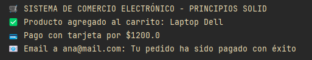

### EJEMPLO PRINCIPIOS SOLID:

Consideraciones:
- Java 21
- Maven

1. COMPILACIÓN:
   - Desde lÍnea de comando tener instalado maven y desde la raíz del proyecto ejecutar
   ```
      mvn package

2. EJECUCIÓN
   - Desde línea de comandos ejecutar en la ruta donde se deposito el archivo jar generado de la compilación: en la carpeta target
   ```
     java -jar ejemplo-solid-1.0-SNAPSHOT.jar

3. SCREEN

   
